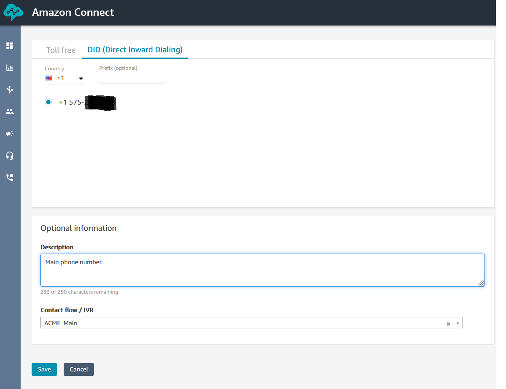

# Amazon Connect Automation and CICD with Terraform and Gitlab
## Section 1 - Solution Overview

This workshop uses Gitlab CI/CD for CI/CD and build processes. Terraform is used to deploy Amazon Connect as well as other associated components. The Lambda function code is written in Typescript. This solution has Multi-Region support, which can be tailored for [Amazon Connect Global Resiliency](https://docs.aws.amazon.com/connect/latest/adminguide/setup-connect-global-resiliency.html) .

#### CI/CD Architecture

The pipelines that deploy Amazon Connect and other associated infrastructure will run in Gitlab CI/CD. Terraform will assume a role in the SDLC (i.e. develop, stage, main) accounts and provision resources directly into them. Each of the pipelines is set up in a matrix format to deploy to both us-east-1 and us-west-2 (although any pair of regions that [supports](https://docs.aws.amazon.com/connect/latest/adminguide/regions.html) Amazon Connect will work). Gitlab itself can be setup to be used with a standalone instance that exists already or by using the free tier of Gitlab.com

> [!NOTE]
> While this code sample highlights how to use Gitlab CICD with OIDC, a similar architecture could be achieved using [Github Actions with OIDC as well](https://docs.github.com/en/actions/deployment/security-hardening-your-deployments/configuring-openid-connect-in-amazon-web-services). 

![[tfcicd-gitlab.png]](images/tfcicd-gitlab.png)

There will be five pipelines deployed 

- amzconnect-instance pipeline which creates the Amazon Connect instance itself.
- amzconnect-admin-objects which will create items that live within Connect such as users, queues, hours of operations, and profiles
- amzconnect-supporting-infra pipeline which creates supporting architectures such as a lex v2 bot, s3 buckets, and any other resource which is not primarily code.
- amzconnect-lambdas pipeline which creates all associated lambda functions and layers. This is separate so that appropriate testing and security patterns can be run against the code itself.
- amzconnect-contact-flows pipeline which deploys the Amazon Connect contact flows themselves to the instance.

![[tfcicd-pipelines.png]](images/tfcicd-pipelines.png)

The code exists in a monorepo with folders for each of the pipelines as well a folder which contains terraform code to get the accounts set up initially.

#### Amazon Connect Flows

In [Amazon Connect](https://aws.amazon.com/connect/) deployments it is common to deploy [Amazon Connect Flows](https://docs.aws.amazon.com/connect/latest/adminguide/connect-contact-flows.html)  that are created using the Amazon Connect console using various [flow block components](https://docs.aws.amazon.com/connect/latest/adminguide/contact-block-definitions.html)  These flows will define the entire user experience from end to end.  The resources referred to in the flow, such as queues, voice prompts, lex bots, and lambda functions when set manually by the name of the resource are saved as an Amazon Resource Name (ARN). The ARN is a unique identifier for a resource that is specific to the service and region in which the resource is created. When flows need to be moved to different Amazon Connect instances in other accounts or regions, the ARNs will no longer accurately reference the required resources. If the resource names are identical in both locations the mappings may still work, however, if the names differ, the flows will break and must be manually updated with new ARNs for each resource. This does not scale well and risks human error.

This design uses  [Amazon Connect contact attributes](https://docs.aws.amazon.com/connect/latest/adminguide/connect-contact-attributes.html) to refer to Amazon Connect resources dynamically instead of manually setting a reference which is then translated to the ARNs themselves. These flow based contact attributes act as indirect references to the resources and are injected into a set contact attributes block in each of the flows that need them during the deployment process. 

This is an Amazon Lex bot example using dynamic refrences:

![[tfcicd-lex.png]](images/tfcicd-lex.png)

This is a Set working queue example:

![[tfcicd-queue.png]](images/tfcicd-queue.png)

To get the contact attributes injected into the flow, a 'Set contact attributes' is added to the beginning of the flow looking similar to the below image. The important components are to set the name of the object to "FLOW_OBJECT_MAPS#" and to set up a single dummy flow attribute. The key and value of the attribute do not matter here as it will be replaced with the actual objects during the flow deployment.

![[tfcicd-ca.png]](images/tfcicd-ca.png)

Once the design of the flow is complete and published, the developer exports it from the development instance and adds it to the repository under amzconnect-contact-flows/lib/callflows. This is an example flow where the content of the flow has already been stringified.

```
{
"Name": "ACME_agent_whisper",
"ContactFlowType": "AGENT_WHISPER",
"Content": "{\"Version\":\"2019-10-30\",\"StartAction\":\"73611771-2716-4560-afb3-bae51560752c\",\"Metadata\":{\"entryPointPosition\":{\"x\":68,\"y\":115},\"snapToGrid\":false,\"ActionMetadata\":{\"ef747366-46cb-4d97-a096-dd34af2a807f\":{\"position\":{\"x\":578,\"y\":145}},\"73611771-2716-4560-afb3-bae51560752c\":{\"position\":{\"x\":256,\"y\":113},\"useDynamic\":false}}},\"Actions\":[{\"Identifier\":\"ef747366-46cb-4d97-a096-dd34af2a807f\",\"Parameters\":{},\"Transitions\":{},\"Type\":\"EndFlowExecution\"},{\"Identifier\":\"73611771-2716-4560-afb3-bae51560752c\",\"Parameters\":{\"Text\":\"$.Queue.Name\"},\"Transitions\":{\"NextAction\":\"ef747366-46cb-4d97-a096-dd34af2a807f\",\"Errors\":[],\"Conditions\":[]},\"Type\":\"MessageParticipant\"}]}"
}
```

# Section 2 - Configuring Gitlab
### Gitlab

This section will focus on the steps necessary to get Gitlab CI/CD configured to be able to deploy resources on AWS. For the purposes of this workshop, it is going to be assumed that either a standalone Gitlab instance is already configured and available to be used, or one can configure a free SaaS account at Gitlab.com.

![[tfcicd-oidc.png]](images/tfcicd-oidc.png)
#### Gitlab SaaS with OIDC

This process allows you to securely deploy infrastructure and apps to multiple AWS accounts from your Gitlab CI/CD, without having to store long lived AWS credentials in Gitlab. The OIDC integration handles authenticating your pipelines to AWS and assuming the right role for each environment.


We will start with configuring a free account on Gitlab.com and then show the differences necessary to configure roles to be used with an on-premises Gitlab system.

![[tfcicd-gitlab-overview.png]](images/tfcicd-gitlab-overview.png)


https://about.gitlab.com/pricing/

Create an account with Gitlab and then create a project

![[tfcicd-project.png]](images/tfcicd-project.png)

An easy way to connect into Gitlab is adding an SSH key to your to profile so that you don't need to use a password to authenticate every time. To do so, follow these [instructions](https://docs.gitlab.com/ee/user/ssh.html)

- Clone or fork the repo from Github. We will be using terraform locally to setup Gitlab in the following steps
- Navigate to the gitlab-terraform-setup/devops_account directory
- We will use terraform to setup an OIDC connection  to a shared devops or tooling account. For additional context, please see this [documentation](https://docs.gitlab.com/ee/ci/cloud_services/aws/) What this process is going to create is an OpenID Connect identity provider in this account, a role with policies that can assume other roles in whatever SDLC accounts (i.e. develop, stage, prod) you would like to use for this process.

#### Steps for setting up devops account:

- Modify the devops.tfvars file to account for your specific repository as well as adding the roles that a new role will be able to assume. We are going to create these  roles in a future step but for the moment, we just need the account numbers of the accounts that will be used. The configuration below will secure the Gitlab connection to be used specifically via the gitlab repo on the specified brances of develop, stage, and prod.
- 
```devops.tfvars
aws_region = "us-east-1"
match_field = "aud"
repo_value = "{{YOUR_GITLAB_ID_HERE}}/{{YOUR_REPO_HERE}}"
aud_value   = "https://gitlab.example.com"
sdlc_roles  = [
"arn:aws:iam::{{DEVELOP_ACCOUNT}}:role/GitLabCI_WorkshopDeploymentRole",
"arn:aws:iam::{{STAGE_ACCOUNT}}:role/GitLabCI_WorkshopDeploymentRole",
"arn:aws:iam::{{PROD_ACCOUNT}}:role/GitLabCI_WorkshopDeploymentRole"
]
```

- export your credentials into the environment
- Run terraform init, plan, and apply using the tfvars file as input as shown below. After the apply, note the output of the ROLE_ARN as we will need it to configure the assume policy on the deployment  roles. 

```
terraform init
terraform plan -var-file devops.tfvars
terraform apply -var-file devops.tfvars
```
#### Steps for setting up SDLC account(s):

The next steps will need to be repeated for all accounts that you wish to provision as SDLC accounts

- Navigate to the gitlab-terraform-setup/sdlc_accounts directory
- configure the tf.tfvars file adding in the ROLE_ARN that was output in the previous step

```
aws_region = "us-east-1"
devops_role_arn = ["DEVOPS_ROLE_ARN"]
```
- export your credentials into the environment
- run terraform init, plan, and apply using the tfvars file as input

```
terraform init
terraform plan -var-file tf.tfvars
terraform apply -var-file tf.tfvars
```
> [!IMPORTANT] 
> If configuring multiple accounts, delete the terraform.tfstate file that will be created into your sdlc_accounts folder before moving to the next one. 


#### Adding Gitlab CICD variables into settings

We now need to add variables into Gitlab that will automatically be inserted into the environment when our pipelines run.

- After logging into your Gitlab account, Navigate to Settings > CI/CD

![[tfcicd-settings.png]](images/tfcicd-settings.png)

- Expand the Variables section so that we can add in variables necessary for this solution. The variables added here will automatically be injected into the environments when the pipelines are running. 

> [!IMPORTANT] 
> A critical step is to uncheck the Protect variable flag when we are adding in the variables. If it is not checked the variables will NOT be passed into your develop and stage accounts


- Add in DEVOPS_ROLE_ARN with the value being the arn output from the devops configuration section

![[tfcicd-variables.png]](images/tfcicd-variables.png)
- Add in AWS_PROFILE with the value being oidc
- Add in AWS_DEFAULT_REGION with the value being us-east-1
- For every SDLC account configured we need to add an AWS_CREDS_TARGET_ROLE  AND lock it to the correct environment. These will be the values we added into the SDLC accounts section. For the develop branch, our environment is dev, For staging it is stg, and for main it is prod. Please refer to the following images.

![[tfcicd-var2.png]](images/tfcicd-var2.png)

![[tfcicd-var3.png]](images/tfcicd-var3.png)

![[tfcicd-var4.png]](images/tfcicd-var4.png)

At the end of this step, the CICD variables should look like the following image. Note that you should only see Expanded under the name and not Protected. If you see protected, edit the variable and uncheck the protect variable field otherwise the pipeline will not be able to see the variables within branches other than main.

![[tfcicd-var5.png]](images/tfcicd-var5.png)
#### Testing the solution

- Clone your Gitlab repo to your local machine (or Cloud9).
- Copy the downloaded repository contents into new Gitlab repo.
- Add the files, commit them, and perform a git push up to the repo.```

```
git add .
git commit -m "test"
git push origin main
```

In the Gitlab console, navigate to Build > Pipelines and select the correct job.

![[tfcicd-pl1.png]](images/tfcicd-pl1.png)

Double click into the assume-role-test, if successful, it should look similar to the image below where you see the devops account assumed, and then the develop account assumed.

![[tfcicd-tfsetup.png]](images/tfcicd-tfsetup.png)

#### Configuring SDLC roles for use with standalone Gitlab system

This section details the steps necessary to deploy when using an internal standalone Gitlab instance. If using OIDC, it can be skipped.

If this solution is being used with a standalone version of Gitlab, it is assumed that there is already an existing devops account configured for use that takes the place of the account configured from the devops_account section. Work with your Gitlab admins to get the arn of that role and add it in place of the DEVOPS_ROLE_ARN in the SDLC instructions. There might be additional configuration (i.e. conditions) that are necessary to add to the assume role policy so that it will work within your environment.

We still need to create the Gitlab variables as specified from the OIDC section above, however we will only need some of the variables which include the roles to assume in the SDLC accounts and the default region:

![[tfcicd-gitlab-onprem.png]](images/tfcicd-gitlab-onprem.png)

##### Additional Resources about OIDC and Gitlab

This youtube link is a great video on securing Gitlab CI/CD with OIDC
https://www.youtube.com/watch?v=xWQGADDVn8g

The section on using OIDC with Gitlab is a modified version of the content located in this blog. Please check it out. - https://aws.amazon.com/blogs/apn/setting-up-openid-connect-with-gitlab-ci-cd-to-provide-secure-access-to-environments-in-aws-accounts/

# Section 3 - Running Pipelines
#### Running Gitlab Pipelines

- We now have functional permissions connecting Gitlab and AWS and can begin to deploy the Amazon Connect instance.
- If you wish to follow a standard SDLC deployment using develop, stage, and main branches, Create a new develop branch
- 
```cli
git checkout -b develop
```
- Otherwise just continue on the main branch.
- Navigate to the .gitlab-ci.yaml file in the root directory and comment out the assume role section and uncomment the remainder of gitlab-ci.yaml file. 
- Add the files, commit them, and perform a git push up to the repo.```

``` cli
git add .
git commit -m "initial"
git push origin develop
```

In the Gitlab console, navigate to Build > Pipelines and select the running job
It should look similar to the image below (which has connect-instance expanded):
- 
![[tfcicd-pl2.png]](images/tfcicd-pl2.png)

- We will need to trigger the pipelines in the correct order which is:
    1. connect-instance
    1. admin-objects
    1. supporting-infra
    1. workshop-lambda
    1. contact-flows

The reason that four of the pipelines have failed is that they reference ssm parameters that originate in the connect instance pipeline.
#### Connect-Instance

- First, examine the terraform files to see what is being provisioned
- Gitlab can be used as a repository for [state files](https://docs.gitlab.com/ee/user/infrastructure/iac/terraform_state.html), so if we look at the backend.tf file we will see the configuration necessary.
```terraform
terraform {
  backend "http" {
  }
}
```
- If we look at the main.tf file, we can see that we are using a [terraform module](https://registry.terraform.io/modules/aws-ia/amazonconnect/aws/latest) that creates an Amazon Connect instance for us. 
- The alias is comprised of various variables that are concatenated to form the name.
- The instance storage configurations are located in the instance_storage_configs.tf file and referenced within the module as a local variable
- The terraform will output the Amazon Connect instance ID into an  [SSM parameter] . Downstream pipelines will reference this parameter as input to determine the target Connect instance for deploying contact flows, lex bots, lambdas, and other ancillary resources in later steps.
##### Run Terraform Plan
- Expand connect-instance, select plan, and then select a region to look at what will be provisioned

![[tfcicd-pl8.png]](images/tfcicd-pl8.png)
- You will see all of the resources to be provisioned from the code located within this particular folder. Towards bottom you should see:

![[tfcicd-plan.png]](images/tfcicd-plan.png)

##### Run Terraform Deploy
- Expand connect-instance, select deploy, and then click the play arrow for the region you wish to deploy first.

![[tfcicd-pl3.png]](images/tfcicd-pl3.png)

At bottom of job page, you should see 

![[tfcicd-apply.png]](images/tfcicd-apply.png)

#### Admin-Objects
- This folder is using the same Amazon Connect module that we just used in the prior step, however we are separating out the components that could frequently be updated. The items that will be provisioned as part of this process are Hours of Operations, Queues, Quick Connects, Routing Profiles, Security Profiles Users and Potentially Contact Lens Vocabularies. We will also deploy a single contact flow to which the Quick Connects will be attached.
- All of the configuration for each of these components is kept in individually named files that have the local variables.
- Re-run Terraform Plan by clicking the Retry button for both regions and then Deploy exactly as we just did in the step above.

![[tfcicd-pl4.png]](images/tfcicd-pl4.png)


#### Supporting-Infra
- This folder will deploy an artifact bucket for contact flows, configuration, as well as CICD artifacts for the lambda functions and Lex bots. It will also deploy the Lex V2 Bot and attach it to the Amazon Connect instance.
- All of the configuration for each of these components is kept in individually named files that have the local variables.
- Run Terraform Plan and Deploy exactly as we just did in the previous steps.

![[tfcicd-pl5.png]](images/tfcicd-pl5.png)


#### Workshop-Lambda
- This folder will deploy two lambda functions used within this workshop. One is merely an example "hello world" type function that demonstrates how to lay that out and the other is a special function named callflow provisioner which takes care of the contact flow deployments. There is also a lambda layer installed that is used by the provisioner.
- The pipelines are slightly different in that we now have a build stage as well as a section where unit tests and other code coverage tests could be run. I
- All of the configuration for each of these components is kept in individually named files that have the local variables.
- Run Terraform Plan and Deploy exactly as we just did in the previous steps.

![[tfcicd-pl6.png]](images/tfcicd-pl6.png)
 

#### Contact-Flows
- This folder will deploy an artifact bucket for contact flows, configuration, as well as CICD artifacts for the lambda functions and Lex bots. It will also deploy the Lex V2 Bot and attach it to the Amazon Connect instance.
- All of the configuration for each of these components is kept in individually named files that have the local variables.
- Run Terraform Plan and Deploy exactly as we just did in the previous steps.

![[tfcicd-pl7.png]](images/tfcicd-pl7.png)


Congratulations! We should now have a working Amazon Connect instance with contact flows deployed!

#### How to Deploy Contact Flows (informational)

The contact flows are in /cicd-connect-workshop/amzconnect-contact-flows/lib/callflows. The format of each flow looks similar to below:

``` 
{
"Name": "ACME_agent_whisper",
 "ContactFlowType": "AGENT_WHISPER",
"Content": "{\"Version\":\"2019-10-30\",\"StartAction\":\"73611771-2716-4560-afb3-bae51560752c\",\"Metadata\":{\"entryPointPosition\":{\"x\":68,\"y\":115},\"snapToGrid\":false,\"ActionMetadata\":{\"ef747366-46cb-4d97-a096-dd34af2a807f\":{\"position\":{\"x\":578,\"y\":145}},\"73611771-2716-4560-afb3-bae51560752c\":{\"position\":{\"x\":256,\"y\":113},\"useDynamic\":false}}},\"Actions\":[{\"Identifier\":\"ef747366-46cb-4d97-a096-dd34af2a807f\",\"Parameters\":{},\"Transitions\":{},\"Type\":\"EndFlowExecution\"},{\"Identifier\":\"73611771-2716-4560-afb3-bae51560752c\",\"Parameters\":{\"Text\":\"$.Queue.Name\"},\"Transitions\":{\"NextAction\":\"ef747366-46cb-4d97-a096-dd34af2a807f\",\"Errors\":[],\"Conditions\":[]},\"Type\":\"MessageParticipant\"}]}"
}
```

An easy way to get the content value of a flow after developing one is to use the AWS CLI. All flows on an instance can be listed using the list-contact-flows command which will give you the flows and their unique contact-flow-id

``` aws-cli
aws connect list-contact-flows --instance-id <value>
```

To describe a particular flow:

``` aws-cli
aws connect describe-contact-flow --instance-id <value> --contact-flow-id <value>
```

Example output:

```
{
    "ContactFlow": {
        "Arn": "arn:aws:connect:us-east-1:XXXXXXXXXXXX:instance/34ed4674-e1c9-43ee-880d-XXXXXXXXXXXX/contact-flow/a318e3af-f88e-45e0-88ac-35808a898b52",
        "Id": "a318e3af-f88e-45e0-88ac-XXXXXXXXXXXX",
        "Name": "Default agent whisper",
        "Type": "AGENT_WHISPER",
        "State": "ACTIVE",
        "Description": "Default whisper played to the agent.",
        "Content": "{\"Version\":\"2019-10-30\",\"StartAction\":\"222caecc-c107-4553-87fc-85a74c34bb06\",\"Metadata\":{\"entryPointPosition\":{\"x\":75,\"y\":20},\"snapToGrid\":false,\"ActionMetadata\":{\"95dc2179-0f18-4646-8e15-15377c9cbb29\":{\"position\":{\"x\":491.0034484863281,\"y\":141.5555419921875}},\"222caecc-c107-4553-87fc-85a74c34bb06\":{\"position\":{\"x\":231.00344848632812,\"y\":96.5555419921875},\"useDynamic\":false}}},\"Actions\":[{\"Identifier\":\"95dc2179-0f18-4646-8e15-15377c9cbb29\",\"Parameters\":{},\"Transitions\":{},\"Type\":\"EndFlowExecution\"},{\"Identifier\":\"222caecc-c107-4553-87fc-85a74c34bb06\",\"Parameters\":{\"Text\":\"$.Queue.Name\"},\"Transitions\":{\"NextAction\":\"95dc2179-0f18-4646-8e15-15377c9cbb29\",\"Errors\":[],\"Conditions\":[]},\"Type\":\"MessageParticipant\"}]}",
        "Tags": {}
    }
}
```

#### Testing the Solution

In this step, we will validate the deployment and make sure that the Contact Center works as expected.

To **test** that the solution works, we need to get into Amazon Connect, [claim a phone number](https://docs.aws.amazon.com/connect/latest/adminguide/tutorial1-claim-phone-number.html) 

and attach it to the 'ACME_Main' flow. The example shows a US DID, however choose whatever works for you.



**Call** the phone number that you claimed in the previous step. The contact flow will ask which department you need. Say "Sales" or "Finance" to enter the customer queue. You will hear a queue message and then music and this can end the workshop. To answer a call, continue with the next few steps.

Two users were created as part of the admin objects pipeline, sales_agent and finance_agent. The passwords for each are SomeSecurePassword!1234.

**Navigate** to Amazon Connect in the AWS portal and select the system that you just created, and click the Access URL. If for some reason, it comes up logged in with the default admin user, you will need to log it out so that you can log back in with one of the newly created users. Click the [-> icon and you should be prompted to log in.


**Navigate** to the Real-time Metrics page
![[tfcicd-metrics.png]](images/tfcicd-metrics.png)

**Add** Queues and Agents to the Real-time Metrics page and then open up the Agent Workspace control panel from the top of the menu bar and set yourself to available so that you can answer a call.

![[tfcicd-agent.png]](images/tfcicd-agent.png)


**Call** in, say Sales or Finance depending on which type of agent you logged in as. You will be placed into the queue and then as the agent you can **answer** the call. You should hear customer and agent whisper flows played. If you navigate to real-time metrics you will see a call.

![[tfcicd-met2.png]](images/tfcicd-met2.png)

To deploy stage, create a new branch for stage and repeat all steps in this section. 
```cli
git checkout -b stage
```

To deploy main, switch to the main branch and repeat all steps in this section.
```cli
git checkout main
```


# Section 4 - Cleanup

To clean up your resources, complete the following steps:

Go into each pipeline start a terraform destroy.

![[tfcicd-cleanup.png]](images/tfcicd-cleanup.png)
If for some reason, the destroy will not run, try starting a new manual job by clicking the Run pipeline button. 

![[tfcicd-clean2.png]](images/tfcicd-clean2.png)

Presumably there will be no new changes to the plan/apply and then the destroy can run.

![[tfcicd-clean3.png]](images/tfcicd-clean3.png)

Destroy the lambda and supporting infra pipelines first. After they are removed start the destroy job on the connect-instance pipeline and it will also destroy all components within the admin-objects and the contact-flows pipelines. 

# Section 5 - Conclusion

In this workshop, you have learned how to set up GitLab CI/CD to securely deploy Amazon Connect and associated resources across accounts and regions using Terraform IaC. Through practical hands-on experience, you configured OIDC authentication for your GitLab pipelines, created deployment roles, set pipeline variables, and triggered automated deployments of an end-to-end Amazon Connect Contact Center solution. By leveraging Terraform modules and separating components into logical pipelines, you built a structured, scalable foundation for delivering continuous delivery of Connect flows, lambdas, and supporting infrastructure. Dynamic references via contact attributes were used instead of hard-coded ARNs to enable portability across accounts and regions. Finally, you validated the deployed contact center by claiming a number, logging in as an agent, and taking a test call. 

There are many possibilities to enhance your contact center delivery through infrastructure as code. Using GitLab CI/CD as your CI/CD engine gives you the flexibility to easily spin up new environments and evolve your Amazon Connect solution while maintaining governance, reducing errors, and speeding up delivery of new features.
